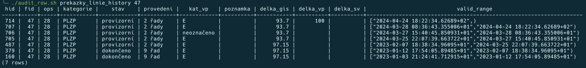
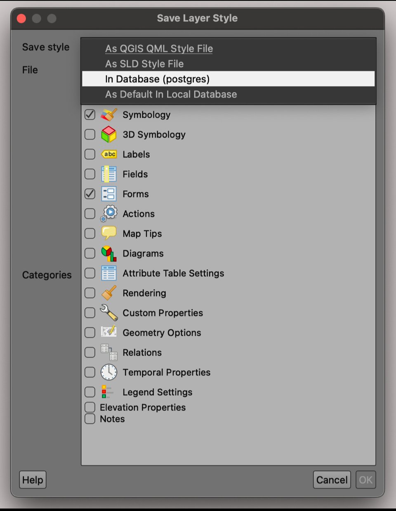

# Překážky těžkého opevnění na Opavsku
Projekt se zaměřuje na vektorizaci průběhu překážek těžkého opevnění
v rámci úseku ŽSV (Ženijní skupinové velitelství) IV. Opava, a to konkrétně 
kolem srubů stavebního úseku Opava (OP-S) v rozmezí OP-S 06 až 36b.

## Členění řešeného území
| Úsek          | Podúsek      | Srub                        |
| --------------|------------- | ----------------------------|
| ŽSV IV. OPAVA | MALÉ HOŠTICE | OP-S 06 NA ZBYTKOVÉM        |
| ŽSV IV. OPAVA | MALÉ HOŠTICE | OP-S 09 NA LUKÁCH           |
| ŽSV IV. OPAVA | MALÉ HOŠTICE | OP-S 10 NA KŘIŽOVATCE       |
| ŽSV IV. OPAVA | MALÉ HOŠTICE | OP-S 11 U CIHELNY           |
| ŽSV IV. OPAVA | MALÉ HOŠTICE | OP-S 12 NA RYTÍŘSKÉM        | 
| ŽSV IV. OPAVA | MALÉ HOŠTICE | OP-S 13 U PÍSKOVNY          |
| ŽSV IV. OPAVA | MALÉ HOŠTICE | OP-S 14 U OBRÁZKU           |
| ŽSV IV. OPAVA | MALÉ HOŠTICE | OP-S 15 U KRUHOVKY          |
| ŽSV IV. OPAVA | JAKTAŘ       | OP-S 16 NA STŘEDNÍM POLI    |
| ŽSV IV. OPAVA | JAKTAŘ       | OP-S 17 NAD SILNICÍ         |
| ŽSV IV. OPAVA | JAKTAŘ       | OP-S 18 U SÁDROVCE          |
| ŽSV IV. OPAVA | JAKTAŘ       | OP-S 19 U FINANČNÍ BUDKY    |
| ŽSV IV. OPAVA | JAKTAŘ       | OP-S 20 NA STŘELNICI        |
| ŽSV IV. OPAVA | JAKTAŘ       | OP-S 21 NA CVIČIŠTI         | 
| ŽSV IV. OPAVA | JAKTAŘ       | OP-S 22 NAD ÚVOZEM          | 
| ŽSV IV. OPAVA | JAKTAŘ       | OP-S 23 NAD POTOKEM         |   
| ŽSV IV. OPAVA | JAKTAŘ       | OP-S 24 NA GELOVĚ POLI      | 
| ŽSV IV. OPAVA | MILOSTOVICE  | OP-S 25 U TRIGONOMETRU      | 
| ŽSV IV. Opava | Milostovice  | OP-S 26 ZA HUMNY MILOSTOVIC | 
| ŽSV IV. OPAVA | MILOSTOVICE  | OP-S 27 PALETOVO POLE       | 
| ŽSV IV. OPAVA | MILOSTOVICE  | OP-S 28 MEZICESTÍ           | 
| ŽSV IV. OPAVA | MILOSTOVICE  | OP-S 29 ROZCESTÍ            | 
| ŽSV IV. OPAVA | ŠIBENICE     | OP-S 30 ŠIBENICE            | 
| ŽSV IV. OPAVA | ŠIBENICE     | OP-S 31 U CESTY             | 
| ŽSV IV. OPAVA | ŠIBENICE     | OP-S 32 KOPANINY            | 
| ŽSV IV. OPAVA | ŠIBENICE     | OP-S 36a HORNÍ DVOJÁK       | 
| ŽSV IV. OPAVA | ŠIBENICE     | OP-S 36b DOLNÍ DVOJÁK       | 

## Podklady
### Archivní letecké meřické snímky
| OP-S | Rok pořízení | Kód snímku |
|------|--------------|------------|
| 06   | 1946         | OPAV54     |
| 09   | 1946         | OPAV74     |
| 10   | 1946         | OPAV74     |
| 11   | 1946         | OPAV73     |
| 12   | 1946         | OPAV73     |
| 13   | 1946         | OPAV73     |
| 14   | 1946         | OPAV73     |
| 15   | 1946         | OPAV73     |
| 16   | 1946         | OPAV83     |
| 17   | 1946         | OPAV83     |
| 18   | 1946         | OPAV83     |
| 19   | 1946         | OPAV93     |
| 20   | 1946         | OPAV93     |
| 21   | 1946         | OPAV93     |
| 22   | 1946         | OPAV93     |
| 23   | 1946         | HBEN02     |
| 24   | 1946         | HBEN02     |
| 25   | 1946         | HBEN02     |
| 26   | 1946         | HBEN02     |
| 27   | 1946         | HBEN02     |
| 28   | 1946         | HBEN12     |
| 29   | 1946         | HBEN12     |
| 30   | 1955         | HBEN12     |
| 31   | 1955         | HBEN12     |
| 32   | 1955         | HBEN21     |
| 36a  | 1955         | HBEN21     |
| 36b  | 1955         | HBEN21     |

### Stavební výkresy ŽSV IV. Opava
| OP-S | Pořízeno   | Měřítko   |
|------|------------|-----------|
| 06   | 19.08.1937 | 1 : 2 880 | 
| 09   | 19.08.1937 | 1 : 2 500 |
| 10   | 19.08.1937 | 1 : 2 500 |
| 11   | 19.08.1937 | 1 : 2 500 | 
| 12   | 19.08.1937 | 1 : 2 500 |
| 13   | 19.08.1937 | 1 : 2 880 |
| 14   | 19.08.1937 | 1 : 2 880 |
| 15   | 19.08.1937 | 1 : 2 880 |
| 16   | 19.08.1937 | 1 : 2 880 |
| 17   | 19.08.1937 | 1 : 2 880 |
| 18   | 19.08.1937 | 1 : 2 880 |
| 19   | 19.08.1937 | 1 : 2 880 |
| 20   | 19.08.1937 | 1 : 2 880 |
| 21   | 19.08.1937 | 1 : 2 880 |
| 22   | 19.08.1937 | 1 : 2 880 |
| 23   | -          | -         |
| 24   | 23.08.1937 | 1 : 2 500 |
| 25   | 23.08.1937 | 1 : 2 500 |
| 26   | -          | -         |
| 27   | 23.08.1937 | 1 : 2 500 |
| 28   | 23.08.1937 | 1 : 2 500 |
| 29   | 23.08.1937 | 1 : 2 500 |
| 30   | 23.08.1937 | 1 : 2 500 |
| 31   | neuvedeno  | neuvedeno |
| 31   | neuvedeno  | neuvedeno |

### Vyúčtovací plány ŽSV IV. Opava 

> [!NOTE]
> Prověřit datum pořízení vyúčtovacích plánů. 

| OP-S | Pořízeno    | Měřítko   |
|------|-------------|-----------|
| 06   | 16.06.1938? | 1 : 2 880 | 
| 09   | 16.06.1938? | 1 : 2 500 | 
| 10   | 16.06.1938? | 1 : 2 500 | 
| 11   | 16.06.1938? | 1 : 2 500 | 
| 12   | 16.06.1938? | 1 : 2 500 | 
| 13   | 16.06.1938? | 1 : 2 880 | 
| 14   | 16.06.1938? | 1 : 2 880 | 
| 15   | 16.06.1938? | 1 : 2 880 | 
| 16   | 16.06.1938? | 1 : 2 880 | 
| 17   | 16.06.1938? | 1 : 2 880 | 
| 18   | 16.06.1938? | 1 : 2 880 | 
| 19   | 16.06.1938? | 1 : 2 880 | 
| 20   | 16.06.1938? | 1 : 2 880 | 
| 21   | 16.06.1938? | 1 : 2 880 | 
| 22   | 16.06.1938? | 1 : 2 880 | 
| 23   | 16.06.1938? | 1 : 2 880 | 
| 24   | 16.06.1938? | 1 : 2 500 | 
| 25   | 16.06.1938? | 1 : 2 500 | 
| 26   | 16.06.1938? | 1 : 2 500 | 
| 27   | 16.06.1938? | 1 : 2 500 | 
| 28   | 16.06.1938? | 1 : 2 500 | 
| 29   | 16.06.1938? | 1 : 2 880 | 
| 30   | 16.06.1938? | 1 : 2 880 | 
| 31   | 16.06.1938? | 1 : 2 880 | 
| 32   | 16.06.1938? | 1 : 2 880 | 
| 36a  | 16.06.1938? | 1 : 2 880 | 
| 36b  | 16.06.1938? | 1 : 2 880 | 

### Československé mapové listy v měřítku 1 : 75 000
| Kód  | Název            | Vydáno  |
|------|------------------|---------|
| 3959 | KRNOV            | 06.1938 | 
| 3960 | SUDICE           | 05.1938 |
| 4059 | BRUNTÁL          | 05.1938 |
| 4060 | MORAVSKÁ OSTRAVA | 09.1938 |

### Neměcké mapové listy - Befestigungskarte Tschechoslowakei v měřítku 1 : 75 000 
| Kód  | Název      | Vydáno   | Přítisk     |
|------|------------|----------|-------------|
| 3959 | TROPLOWITZ | 08.1938? | 15.07.1938  |
| 3960 | RATIBOR    | 02.1938? | 15.07.1938  |
| 4059 | BRUNTÁL    | 02.1938? | 15.07.1938  |
| 4060 | HULTSCHIN  | 02.1938? | 15.07.1938  |

### Archivní fotodokumentace
Pro účely oveření provedení jednotlivých částí liniových překážek a pro indentifikaci
lokálních anomálií byly použity dobové fotografie, a to jednak volně dostupné, tak i v 
soukromém vlastnictví spoluautora. 

### Měření a fotodokumentace z terénu
Nedílnou součástí identifikace průběhu překážek těžkého opevnění je i průzkům a měření
v terénu. Vybrané úseky bylo z důvodu husté vegetace a špatně přístupného terénu obnažit 
a následně bylo možné provést měření a lokalizaci zachovaných zbytků překážek za pomocí GPS.


## Geodatabáze
Data jsou ukládána a spravována v relační databázi [**PostgreSQL**](https://www.postgresql.org), která je 
rozšířena o nadstavbu [**PostGIS**](https://postgis.net) pro práci s prostorovými daty. 

### Konfigurace Geodatabáze
> [!NOTE]
> Indexes, Trigger Functions...

### Struktura geodatabáze
```
pto_opavsko
├── audit
│   └── <table_name>_history
│   
├── detail
│   
├── lookups
│   └── <column_name>_lookup
│   
├── main
│   
├── overview_13kk
│   
├── overview_75k
│   
├── public
│   ├── geography_columns
│   ├── geometry_columns
│   ├── layer_styles
│   ├── qgis_projects
│   ├── raster_columns
│   ├── raster_overviews
│   └── spatial_ref_sys
│   
└── rasters
```

#### Schéma `audit` 
Schéma obsahuje tabulky, které zaznamenávají změny při editace (geometrie + další informativní údaje).
Účelem tabulek s příponou `_history` je trasování změn ve výchozí tabulce. Tabulka `prekazky_linie_history` 
tedy zaznamenává změny v tabulce `prekazky_linie`. V případě potřeby lze sledovat průběh editace vybraných geometrií, 
potažmo obnovit původní geometrii vybraného prvku.

**:point_right: Příklad auditu vybrané prvku (řádku) v tabulce**   
Informace ohledně časové stopy editace jsou uloženy ve sloupci `valid_range`, ve kterém se zaznamenává proces vytvoření, 
aktualizace a odstranění prvku vybrané tabulky. Jednotlivým změnám v tabulce je přiřazen unikátní identifikátor (`hid`) - tzv. 
"history id". Ty jsou v tabulce zaznamenávány chronologicky.

Pokud potřebuje prověřit vývjoj editace vybraného prvku s prostorovou informací v tabulce `main.prekazky_linie`, tak nejdříve musíme 
identifikovat příslušné `fid` (feature id) prvku v této tabulce. Po zjištění `fid` spustíme v příkazovém řádku připravený shell skript
[**audit_row.sh**](https://github.com/zwarott/pto-opavsko/blob/database/audit/audit_row.sh), přičemž jako parametry vepíšeme název tabulky
`prekazky_linie` a zjištěné `fid`:
```
./audit_row.sh preakzky_linie_history 47
```

Na níže uvedené ukázce je demonstrován proces změny vybraného prvku v tabulce s (`fid = 47`). Tento prvek byl vytvořen `2023-01-03 21:24:41` 
a naposledy změněn v `2024-04-24 18:22:34`.První časový záznam ve sloupci `valid_range` představuje čas, kdy byl prvek buď vytvořen  
nebo aktualizován. Druhý časový záznam  představuje čas, kdy byl prvek buď odstraněn nebo aktualizován.  V případě aktualizace je nejdříve 
u vytvořeného prvku vyplněn druhý časový záznam. Následně je vygenerován nový řádek, kde je vložen duplikát druhého časového záznamu předchozího řádku. 
Aktualizace prvku se tedy chová jako kdyby byl prvek odstraněn a ihned znovu vytvořen.



**:point_right: Příklad filtrování prvků (řádků) dle časových záznamů**   
Změny v tabulce můžeme kontrolovat i dle časových paramtrů:

Audit vybraných prvků v časovém rozpětí - [**audit_from_to.sh**](https://github.com/zwarott/pto-opavsko/blob/database/audit/audit_from_to.sh):
```
./database/audit/audit_from_to.sh <table> <from> <to>
```

Audit vybraných prvků od vybraného časového záznamu - [**audit_over.sh**](https://github.com/zwarott/pto-opavsko/blob/database/audit/audit_over.sh):
```
./database/audit/audit_over.sh <table> <over>
```

Audit vybraných prvků do vybraného časového záznamu - [**audit_under.sh**](https://github.com/zwarott/pto-opavsko/blob/database/audit/audit_under.sh):
```
.database/audit/audit_over.sh <table> <under>
```

#### Schéma `detail` 
Schéma obsahuje vrstvy v podrobném měřítku (zpravidla 1 : 1 000 a větším). Jedná se zejména o geodetické
zaměření a detailní provedení liniových překážek opevnění.

#### Schéma `lookups` 
Schéma obsahuje tabulky bez prostorové informace. Jedná se o tzv. tabulky s cizími klíčy, neboli tabulky s vybraným
atributem (sloupcem), pro který jsou přednastaveny povolené vstupní hodnoty. Po propojení s cílovou tabulkou je zabezpečeno,
že do vybraného atributu nebude vložena hodnota nebo údaj, který není nadefinován v tabulce s příponou `_lookup`.

> [!TIP]
> Využití cizích klíčů nabízí možnosti propojení s QGIS Forms. Při editaci vrstvy v prostředí QGIS uživatel vybírá hodnotu/údaj 
> z předchystaného seznamu. Tím je zaručena eliminace chyb při ručním vyplňování v atributové tabulce.

**:point_right: Příklad propojení tabulek za použití cizích klíčů**   
Atribut `podusek` v tabulce `overview_75k.pozice_srubu_overview` může obsahovat pouze údaje, které jsou obsažené ve
sloupci `podusek` v tabulce `lookups.podusek_lookup`.


#### Schéma `main` 
Schéma obsahuje vrstvy (tabulky) zobrazitelné ve standardním měřítku (zpravidla k 1 : 2 000).

#### Schéma `overview_13kk` 
Schéma obsahuje vrstvy (tabulky) zobrazitelné zpravidla v měřítku 1 : 13 000 000.

#### Schéma `overview_75k` 
Schéma obsahuje vrstvy (tabulky) zobrazitelné zpravidla v měřítku 1 : 75 000.

#### Schéma `public` 
Jedná so o výchozí schéma, které v rámci daného projektu obsahuje zejména konfigurační nastavení geodatabáze, QGIS projektu
a výchozí stylování tabulek (vrstev). Pro účely práce s prostorovými daty jsou součástí výchozího schématu metadatové tabulky
pro integraci lokálních a globálních kordinačních referenčních systémů (`geoography_column`, `geometry_column`, `spatial_ref_sys`).
Jelikož je projekt primárně zpracováván v prostředí QGIS, tak je do geodatabáze ukládáno výchozí stylování vektorových vrstev (`layer_styles`)
včetně projektového souboru (`qgis_projects`), který v sobě skrývá cesty importovaných vektorových vrstev z geodatabáze, 
doprovodných rastrových snímků či WMS služeb. Pro účely exportu jsou v projektovém souboru uloženy i výkresové sestavy.

**:point_right: Export stylů do geodatabáze**   
V prostředí QGIS lze vyexportovat styly níže uvedeným postupem:
`Layer Properties` > `Export` > `Save as QGIS Layer Style File`.
Po vyexportování bude styl propojen s odpovídající vrstvou (tabulkou v databázi).



#### Schéma `rasters`
Pro práci s rastrovými snímky využívá projekt [**knihovnu GDAL**](https://gdal.org).

**:point_right: Georeferencování**

**:point_right: Import rastrového snímku do geodatabáze**   
Pro import rastrového snímku do geodatabáze stačí spustit v příkazovém řádku níže shell skript 
[**import_raster.sh**](https://github.com/zwarott/pto-opavsko/blob/database/rasters/raster_import.sh), kde `input_raster` představuje cestu
ke vstupnímu rastru, zatímco `raster_table` odpovídá importovanému rastru v geodatabázi:
```
./database/rasters/import_raster.sh <input_raster> <raster_table>
```

**:point_right: Přehled o uloženém rastru v databázi**   
Pro zprostředkování výpisu [**vlastností**](https://gdal.org/programs/gdalinfo.html#gdalinfo) uloženého rastru v geodatabázi slouží 
[**raster_info.sh**](https://github.com/zwarott/pto-opavsko/blob/database/rasters/raster_info.sh). Zde postačí pouze vepsat název rasterového snímku
v geodatabázi: 
```
./database/rasters/raster_info.sh <raster_table> 
```

### Zálohování geodatabáze
Geoatabáze je zálohována a následně šifrována za pomocí [**GNU Privacy Guard**](https://www.gnupg.org/software/index.html).

Po spuštění skriptu v příkazovém řádku je uživatel vyzván k zadání hesla pro účely šifrování.
Následně potvrdí nově zvolené heslo. Pokud je geodatabáze zabezpečena heslem, tak je nutné zadat i toto heslo. 
```
python ./database/backup/run_backup_encrypt.py
``` 

Šifrovanou databázi lze dešifrovat příkazem v příkazovém řádku , kde `output_file.sql` reprezentuje dešifrovanou geodatabázi, 
zatímco `input_file.sql.gpg` představuje vstupní, zašifrovanou geodatabázi.
 
```
gpg --output output_file.sql --decrypt input_file.sql.gpg
```


## Výstupy
### Sledovaný úsek - obecný přehled (1 : 60 000)
Mapový výstup vyobrazuje délku řešeného úseku v měřítku 1 : 60 000, který je doplněn o rozmístění překážek přes komunikaci a vybrané archivní fotografie.
Výstup je dostupný ve formátu PNG - [**obecný přehled**](https://github.com/zwarott/pto-opavsko/blob/main/outputs/overviews_60000/overview_general_cz.png). 

### Sledovaný úsek - podúseky (1 : 60 000)
Mapový výstup vyobrazuje délku řešeného úseku v měřítku 1 : 60 000 se zaměřením na rozdělení na jednotlivé podúseky, které jsou
barevně odlišeny a doplněny o náhledy liniových překážek kolem pěchotních srubů.
Výstup je dostupný ve formátu PNG - [**podúseky**](https://github.com/zwarott/pto-opavsko/blob/main/outputs/overviews_60000/overview_subsections_cz.png). 

### Atlas I. Generalizovaný průběh překážek (1 : 2 000)
Exportované snímky průběhu liniových překážek představují generalizovaný průběh vzhledem k měřítku 1 : 2 000.
Generalizace spočívá jednak ve zjednodušení geometrie liniových prvků, tak i v agregaci jednotlivých kategorií.
Výstupy jsou dostupné ve formátu PNG v adresáři [**generalized_2000**](https://github.com/zwarott/pto-opavsko/tree/main/outputs/generalized_2000). 

#### Kategorizace překážek
| Typ                 | Kategorie        | Stav        | OP-S                                                                        |
|---------------------|------------------|-------------|-----------------------------------------------------------------------------|
| intervalová         | těžká            | dokončena   | 06, 09, 10, 15, 16, 17, 18, 19, 21, 22, 24, 25, 26, 27, 28, 29, 30          |
| intervalová         | těžká            | nedokončena | 11, 12, 13, 14, 15, 20, 22, 23, 24                                          |
| intervalová         | přírodní         | přírodní    | 22                                                                          |
| intervalová         | přírodní (vodní) | přírodní    | 06, 09, 20                                                                  |
| protitankový příkop | stěna            | dokončena   | 06, 11, 12, 13, 14, 15, 16, 17, 18, 19, 22, 23, 24, 30, 31, 32, 36a         |
| protitankový příkop | stěna            | nedokončena | 21, 25, 26, 27, 28, 29, 31, 32, 36a                                         |
| protitankový příkop | lehká            | dokončena   | 06, 09, 10, 11, 12, 13, 15, 16, 17, 18, 19, 22, 23, 24, 25, 30, 31, 32, 36a | 
| protitankový příkop | lehká            | nedokončena | 14                                                                          |
| protitankový příkop | lehká            | provizorní  | 26, 27, 28, 29, 31, 32, 36a                                                 |
| protitankový příkop | přírodní         | přírodní    | 22                                                                          |
| obvodová            | čelní těžká      | dokončena   | 06, 09, 10, 15, 16, 17, 18, 19, 25, 26, 27, 28, 29, 30, 31, 32, 36a, 36b    |
| obvodová            | čelní těžká      | nedokončena | 11, 12, 13, 14, 20, 22, 23, 24                                              |
| obvodová            | čelní těžká      | provizorní  | 21                                                                          |
| obvodová            | týlová lehká     | dokončena   | 06, 09, 10, 11, 12, 13, 14, 15, 16, 17, 18, 19, 21, 22, 23, 24, 25          |
| obvodová            | týlová lehká     | nedokončena | 20                                                                          |
| obvodová            | týlová lehká     | provizorní  | 26, 27, 28, 29, 30, 31, 32, 36a, 36b                                        |

### Atlas II. Detailní průběh překážek (1 : 1 000)

#### Kategorizace překážek

> [!NOTE]
> Vytvořit přehlednou tabulku ke kategorizaci překážek v detailu (měřítko 1 : 1 000).
